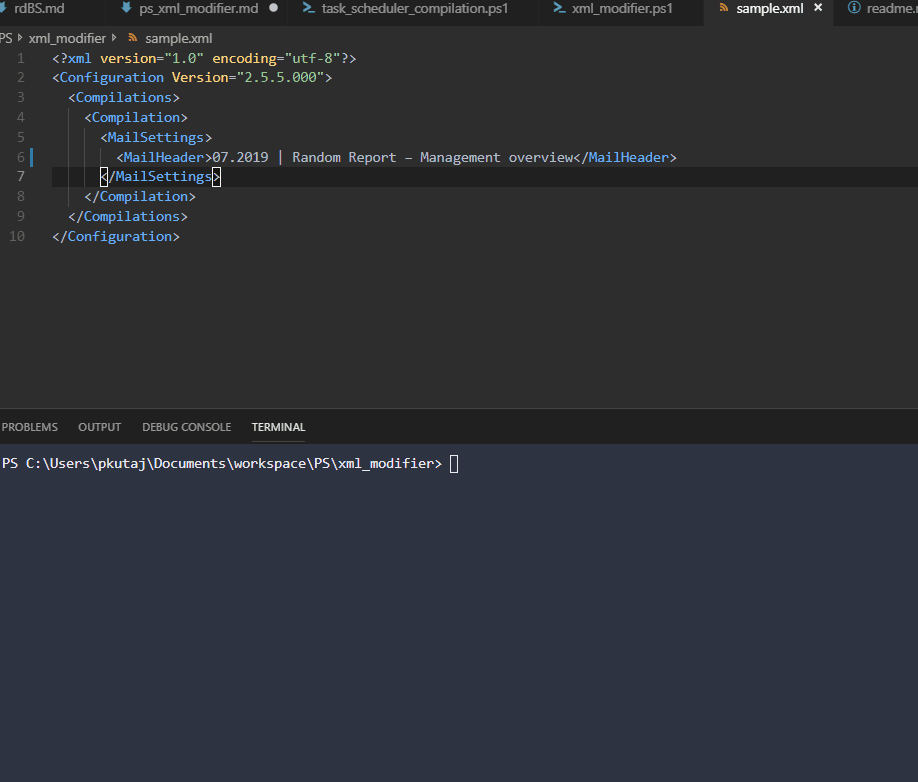

# XML MODIFIER

## PURPOSE
The aim of this code is to modify an xml file in order to populate required fields with current month. 

## TOC
* [code](xml_modifier.ps1)
* [sample_data](sample.xml)
* [kb](ps_xml_modifier.md)

## SIGNATURE 
mrPaul, Brno, 2019-08-06 15:27:37
